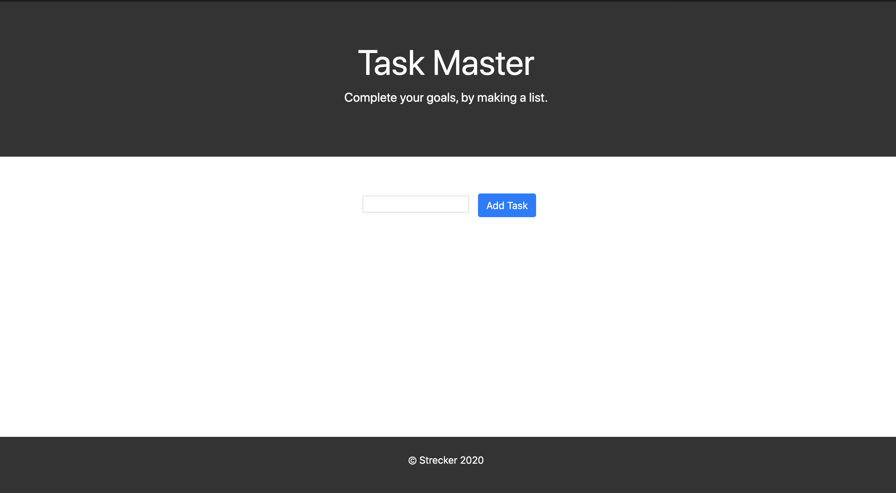

# Task-List

Used JQuery (JavaScript Library) to dynamically create and update the HTML markup. 

## Built With

* HTML5
* CSS3
* JavaScript
* JQuery

## My Solution

 

## Published on GitHub Pages

[deployed_link](https://lauriestrecker.github.io/HW-Wireframe/ "GitHub Pages")

## Versioning

GitHub 

## License

[MIT](https://choosealicense.com/licenses/mit/)